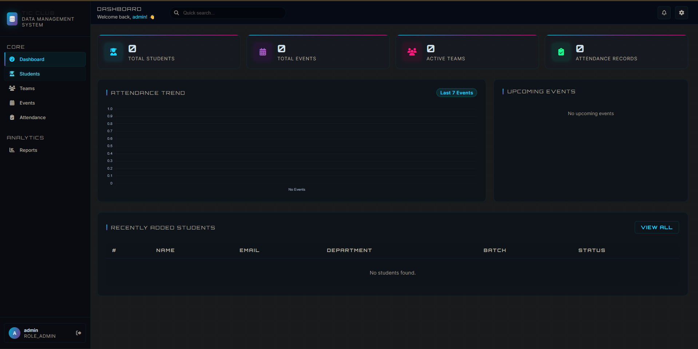
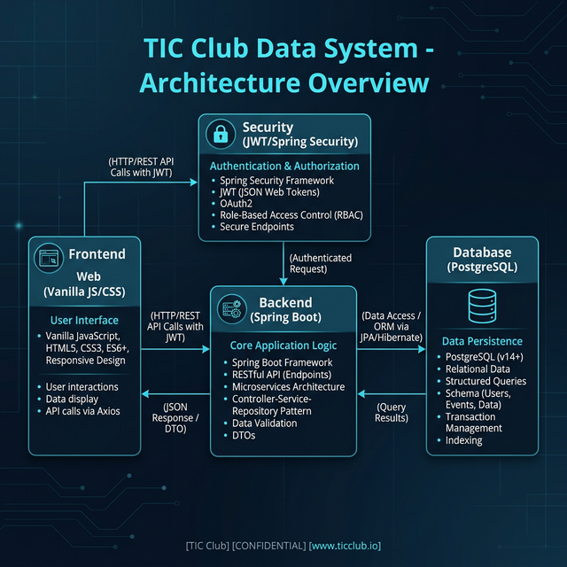

# 🚀 TIC Club - Coordinator Data Management System



## ✨ Overview
The **TIC Club Data Management System** is a high-performance, enterprise-grade platform designed to streamline student club operations. Built with a modern **Cyberpunk Aesthetic** and powered by a robust **Spring Boot** backend, it enables coordinators to manage students, teams, events, and attendance with surgical precision.

### 🌌 Key Visual Experience
- **Glassmorphism UI**: A premium, frosted-glass interface that feels state-of-the-art.
- **Vibrant Status Tracking**: Intelligent color-coding for event statuses and attendance.
- **Responsive Dashboard**: Real-time analytics at your fingertips.

---

## 🛠️ Tech Stack
| Layer | Technologies |
| :--- | :--- |
| **Backend** |   |
| **Frontend** |    |
| **Database** |  |
| **Security** |   |

---

## ⚡ Core Features

### 👥 Student Management
- Full CRUD operations for student profiles.
- Automated validation for Roll Numbers and Emails.
- Registration year tracking and department categorization.

### 📅 Event Management
- Schedule workshops, meetings, and club activities.
- Real-time location and date tracking.
- **Coordinator Attribution**: Every event is linked to its creator.

### 🏅 Team Formation
- Create specialized teams for projects.
- Dynamic member assignment with cascading validation.

### 📊 Attendance 2.0
- **Multi-Status Support**: Track `PRESENT`, `ABSENT`, and the newly added `LATE` status.
- **Smart Analytics**: Attendance rates calculated against total club strength.
- **Instant Feedback**: Toast notifications for every record saved.

---

## 🏗️ System Architecture
The system follows a **Clean Architecture** pattern, ensuring high maintainability and security.



---

## 🚀 Getting Started

### 1. Prerequisites
- **Java 17+**
- **Maven 3.6+**
- **PostgreSQL 14+**

### 2. Backend Setup
```bash
cd backend
# Update application.properties with your DB credentials
mvn spring-boot:run
```

### 3. Frontend Setup
The frontend is built with Vanilla JS. Simply serve the `frontend` directory using any web server.
- **Recommended**: Live Server (VS Code Extension) or `npx serve frontend`.

### 4. Default Credentials
- **Username**: `admin`
- **Password**: `admin123`

---

## 📈 Engineering Flow (Agile)
This project was developed using an **Agile-Scrum** framework:
1. **Backlog Refinement**: Defining core CRUD requirements.
2. **Sprint 1 (Foundation)**: JWT Security & Database Schema.
3. **Sprint 2 (Core)**: Business Logic & UI Implementation.
4. **Sprint 3 (Polish)**: Advanced Statuses (LATE), Toast Notifications, and QA.

---

## 🤝 Contribution
Contributions are welcome! Feel free to open an issue or submit a pull request.

---

## 📜 License
Internal Project for **TIC Club**.
